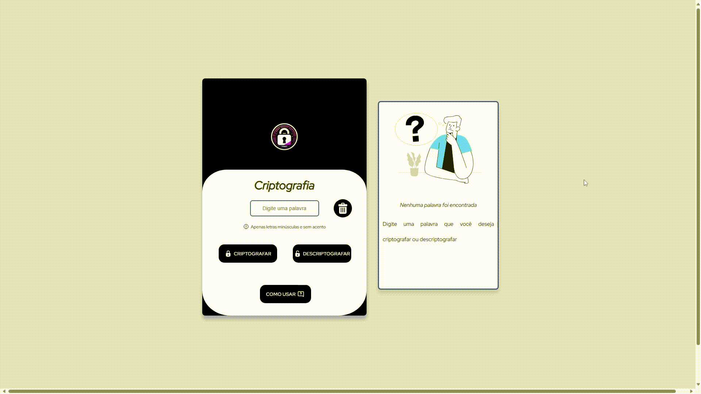

<div align="center">
<h1 align="center"> Sprint 1 Challenge ONE - Turma 06</h1>

<p>O programa ONE - Oracle next education é um programa da Oracle em parceria com alura, de educação e empregabilidade com objetivo social de capacitar pessoas em tecnologia e conectá-las com o mercado de trabalho por meio de empresas parceiras.</p>
</div>
<div align="center">
  <a href="#sobre-o-desafio">Sobre o desafio</a>&nbsp;&nbsp;&nbsp;|&nbsp;&nbsp;&nbsp;
  <a href="#Site">Site</a>&nbsp;&nbsp;&nbsp;|&nbsp;&nbsp;&nbsp;
</div>

<h1 id="sobre-o-desafio"> Sobre o desafio</h1>

Desenvolver uma aplicação que criptografa e descriptografa textos.

### As "chaves" de criptografia são:

>A letra "e" é convertida para "enter"
>A letra "i" é convertida para "imes"
>A letra "a" é convertida para "ai"
>A letra "o" é convertida para "ober"
>A letra "u" é convertida para "ufat"

Requisitos:
>- Deve funcionar apenas com letras minúsculas
>- Não devem ser utilizados letras com acentos nem caracteres especiais
>- Deve ser possível converter uma palavra para a versão criptografada e também retornar uma palavra criptografada para a versão original.
>Por exemplo:
```
"gato" => "gaitober"
gaitober" => "gato"
```
>- Um botão que copie o texto criptografado/descriptografado para a área de transferência - ou seja, que tenha a mesma funcionalidade do ctrl+C ou da opção "copiar" do menu dos aplicativos.
>A página deve ter campos para inserção do texto a ser criptografado ou descriptografado, e a pessoa usuária deve poder escolher entre as duas opções
O resultado deve ser exibido na tela.

<h2 id="Site">Site finalizado</h2>
<p></p>
<br>


